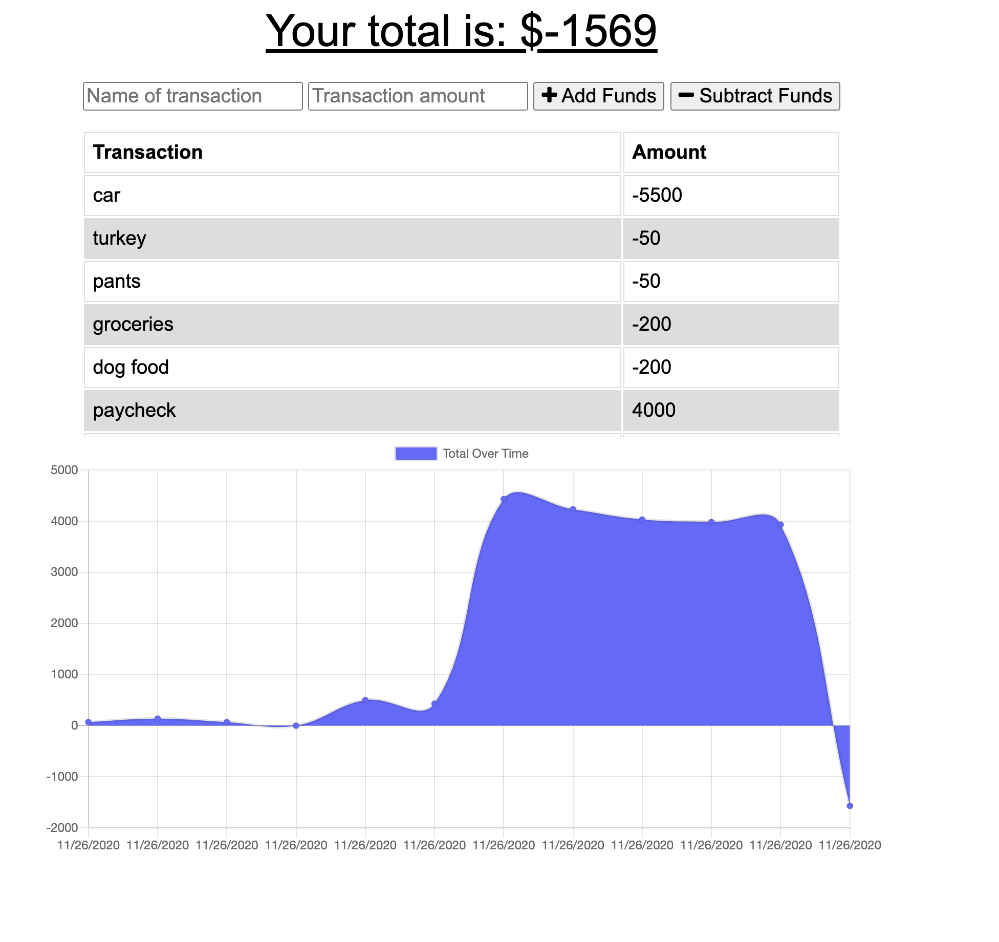

# Online/Offline Budget Trackers
## Deployed Heroku Link
[budget-app-pwa](https://budget-app-pwa-idallas93.herokuapp.com/ "budget-app-pwa heroku link")

The user is be able to add expenses and deposits to their budget with or without a connection. When entering transactions offline, they can populate the total when brought back online.

## Application Images 

### Home Page 
Inline-style: 

Offline Functionality:

  * Enter deposits offline

  * Enter expenses offline

When brought back online:

  * Offline entries should be added to tracker.

## User Story
AS AN avid traveller
The user is able to track withdrawals and deposits with or without a data/internet connection
SO THAT their account balance is accurate when traveling
